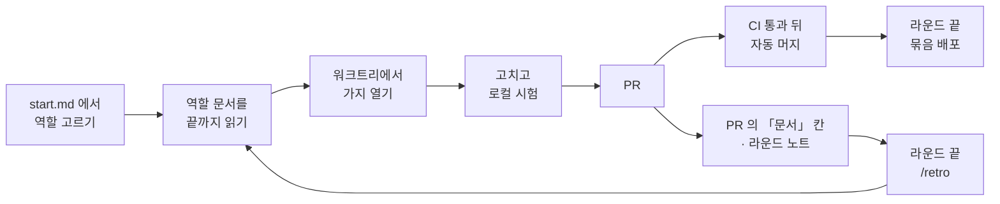

# 사람을 위한 안내 — 이 저장소를 처음 (또는 오랜만에) 여는 분께

> **이 문서는 사람을 위한 것이에요.** 에이전트는 이 문서를 읽지 않아도 되고, 어떤 역할 문서도 이 문서를 가리키지 않아요.
> 여기에는 규칙이 없어요. 규칙은 각 절이 링크하는 **원본 문서**에 있고, 이 문서는 그 원본을 쉬운 말로 풀어서 길을 알려 줄
> 뿐이에요. **이 문서와 원본이 다르면 원본이 맞아요.** 원본이 바뀌어도 이 문서는 늦게 따라올 수 있어요.

저장소의 문서는 대부분 에이전트가 빨리 읽도록 짧고 촘촘한 말투로 적혀 있어요. 「잰 값」 · 「문」 · 「든다」 · 「붉은 main」
같은 말이 설명 없이 나와요. 몇 주 만에 돌아왔거나 처음 함께하는 분은 이 문서부터 읽고, 모르는 말은 맨 아래
[사내 용어 풀이표](#6-사내-용어-풀이표)에서 찾아보세요.

## 1. 이 저장소가 일하는 방식 한눈에

### 누가 일하나요

| 누구 | 하는 일 |
| --- | --- |
| **운영자** | 사람이에요. 서비스의 주인이고 결정을 내려요. 정책 · 화면 문구 · 비용 · 운영 배포 · AI 실호출은 운영자가 답하거나 직접 해요. |
| **조율자** | 운영자와 대화하는 AI 세션이에요. 직접 코드를 고치지 않고 역할 에이전트에게 일을 맡겨요. 에이전트들의 질문을 모아 운영자에게 한 번에 묻고, PR 을 어떤 순서로 머지할지 정해요. ([조율자 역할](roles/coordinator.md)) |
| **역할 에이전트 7** | 실제로 고치는 AI 에이전트예요. 맡은 일의 종류에 따라 일곱 역할 중 하나를 받아요. |

역할 일곱은 이래요. 자세한 표는 [`docs/start.md` 「역할 고르기」](start.md#역할-고르기)에 있어요.

| 역할 | 맡는 일 |
| --- | --- |
| `ui` | 화면의 모양 · 문구 · 디자인 |
| `feature` | 기능이나 흐름을 더하거나 동작을 바꾸기 |
| `db` | 데이터베이스의 표 · 함수 · 접근 정책(마이그레이션)과 그 시험 |
| `reading` | 사주 풀이 글 · AI 프롬프트 · 만세력 계산 엔진 |
| `ops` | 배포 · 운영 DB 확인 · 정기 작업(크론) · 운영 절차 |
| `reviewer` | 읽기만 하는 검토 · 감사 · 두 번째 의견 |
| `docs` | 문서와 대장(장부)을 코드와 결정에 맞추기 |

### 문서와 시험 — 어긋나면 시험이 맞아요

규칙을 적은 문서는 대부분 **「정한 규칙」이 아니라 「어느 날 코드를 재 보니 이랬다」는 측정 기록**이에요. 저장소에서는
이것을 「잰 값」이라고 불러요([ADR 0086](adr/0086-the-code-rules-are-measured-then-held-by-lint-and-tests.md)).

그리고 중요한 규칙은 **시험이나 린트가 자동으로 지켜요.** 이것을 「잠금」이라고 해요. 그래서 문서와 시험이 서로 다른 말을
하면 **시험 쪽이 맞고, 문서를 고쳐요.**

- 코드가 어디에 사는지 → [`docs/architecture.md`](architecture.md), 지키는 시험은 `scripts/layers.test.ts` · `eslint.config.mjs`
- 코드를 어떻게 적는지 → [`CODING_STANDARDS.md`](../CODING_STANDARDS.md), 지키는 시험은 `scripts/code-rules.test.ts` · 린트
- 무엇을 돌리는지 → [`docs/agents/test-map.md`](agents/test-map.md), 실제 규칙은 `scripts/ci-plan.mjs`

단, **「제품이 무엇을 해야 하나」는 다른 이야기예요.** 그건 PRD([`docs/prd.md`](prd.md))와 ADR, 운영자 결정이 답해요. 코드와
PRD 가 다르면 무조건 한쪽을 따르지 않고, 먼저 버그인지 · 문서가 낡았는지 · 결정이 아직 안 들어갔는지를 가려요
([조율자 세션 「사실과 의도」](agents/delegation/coordinator.md)).

### 어느 문서가 무엇을 답하나요

한 사실은 한 문서에만 적어요. 어느 문서가 어느 질문의 원본인지는 [`docs/start.md` 「원본」 표](start.md#원본--무엇이-무엇을-답하나)가
정리해 둬요. 자주 여는 것만 추리면 이래요.

| 궁금한 것 | 열 문서 |
| --- | --- |
| 제품이 지금 무엇을 하나 | [`docs/prd.md`](prd.md) (색인) → `docs/product/prd/` 의 영역 파일 |
| 아직 없거나 안 정한 것 | [`docs/product/gaps.md`](product/gaps.md) (간극 대장) |
| 언제 무엇이 바뀌었나 | [`docs/product/prd-changelog.md`](product/prd-changelog.md) |
| 제품 낱말의 뜻 | [`GLOSSARY.md`](../GLOSSARY.md) (색인) → `docs/context/` |
| 왜 이렇게 정했나 | [`docs/adr/README.md`](adr/README.md) (지금 유효한 결정의 목록) |
| 운영에서 무엇을 어떤 순서로 | [`docs/ops/runbook.md`](ops/runbook.md) |
| 지난 라운드에 무슨 일이 있었나 | [`docs/notes/README.md`](notes/README.md) (요구사항이 아니에요) |

`docs/product/prd-archive.md` 는 옛 요구사항 문서예요. 코드 주석의 옛 번호를 찾을 때만 열고, 무엇을 만들지는 거기서 읽지 않아요.

## 2. 일의 흐름 — 선순환

일 하나가 시작돼서 운영에 나가고 문서로 돌아오기까지의 길이에요. 원본은 [`docs/start.md` 「선순환」](start.md#선순환--일이-문서로-돌아오는-길)이에요.

1. **입구는 [`docs/start.md`](start.md)예요.** 거기서 역할을 하나 고르고, 그 역할 문서([`docs/roles/`](roles/))를 끝까지 읽어요.
   역할 문서는 한 화면짜리 길잡이예요. 「먼저 읽을 것 · 이 저장소의 방식 · 하지 않을 것 · 끝날 때 고칠 것」만 들고, 규칙 자체는
   원본 문서를 링크로 가리켜요([ADR 0140](adr/0140-each-role-reads-its-page-first-and-closes-by-fixing-the-docs.md)).
2. **시작 전에 확인해요.** main 이 깨져 있으면(`ci-main-red` 이슈가 열려 있으면) 그것부터 고쳐요. 다른 세션이 무엇을 하고
   있는지도 `git worktree list` 로 봐요.
3. **워크트리에서 일해요.** 같은 폴더에서 여러 세션이 돌기 때문에, 작업은 늘 별도 워크트리와 별도 가지에서 해요. 데이터베이스를
   쓰는 일이면 워크트리마다 로컬 스택 「자리」 번호를 받아 서로 덮어쓰지 않게 해요
   ([일하는 법 「저장소와」](agents/delegation/working.md)).
4. **고치고, 로컬에서 최소한의 시험을 돌려요**(아래 4절).
5. **PR 을 열어요.** main 에는 아무도 직접 넣지 못하고 PR 로만 들어가요(관리자도요, [ADR 0121](adr/0121-main-takes-changes-only-through-pull-requests-even-from-admins.md)).
   PR 본문에는 정해진 칸 여섯을 채워요 — 무엇이 참이 되나 · 잰 값 · 돌린 것 · 잠금이면 일부러 어긴 것 · 문서 · 사람이 할 걸음
   ([끝났다는 것](agents/delegation/done.md)).
6. **CI 가 돌고, 통과하면 자동으로 머지돼요**(`gh pr merge --auto`). 단 결정이 들어간 PR 은 운영자가 답하기 전엔 머지하지 않아요.
7. **머지는 배포가 아니에요.** main 에 들어가도 운영 사이트는 바뀌지 않아요. 라운드가 끝나면 조율자가 운영자에게 「배포」 답을
   받고 최신 main 을 한 번에 올려요(묶음 배포). 데이터베이스 변경(마이그레이션)은 앱보다 **먼저, 따로** 올려요
   ([배포](ops/runbook/deploy.md), [ADR 0110](adr/0110-merging-is-not-deploying-production-ships-once-per-bundle.md)).
8. **머지 뒤 main 에서 전체 검증이 한 번 더 돌아요.** 깨지면 `ci-main-red` 이슈가 자동으로 열리고, 다음 일보다 먼저 고쳐요.
9. **일이 문서로 돌아와요.** 끝난 에이전트는 PR 의 「문서」 칸에 고친 문서를 적고, 역할 문서에 없어서 헤맨 것을 보고에 한 줄
   남겨요. 라운드의 사정은 `docs/notes/` 에 노트로 남겨요. 라운드 끝에 조율자가 그 보고들을 모아 돌아보기를 해요 — 이 돌아보기는
   `/retro` 스킬로 돌리는 쪽으로 바뀌는 중이에요(PR #505). 그 전에는 조율자가 역할 문서를 직접 고쳤어요.

## 3. 코드의 층 넷과 방향

코드는 네 층으로 나뉘고, **위층은 아래층을 불러도 되지만 아래층은 위층을 부르면 안 돼요.** 원본은
[`docs/architecture.md` 「층 넷」](architecture.md)이에요.

| 층 | 어디 | 쉬운 설명 |
| --- | --- | --- |
| **엔진** | `src/lib/saju/` | 생년월일시로 사주를 계산하는 순수한 계산기예요. 다른 코드는 아무것도 몰라요. |
| **도메인 lib** | `src/lib/` 의 나머지 폴더 | 풀이 · 매칭 · 동의 같은 업무 판단이에요. 엔진은 부르지만 화면이나 DB 연결은 몰라요. |
| **문과 액션** | `app/**/*.ts` | DB 를 실제로 부르는 자리예요. DB 를 읽는 함수를 「문」이라고 불러요. 서버 액션 · 라우트도 여기예요. |
| **화면** | `app/**/*.tsx` | 그리기만 해요. **DB 를 직접 부르지 않고** 문을 거쳐요. |

방향은 `엔진 ← 도메인 lib ← 문·액션 ← 화면` 이에요. 거꾸로 부르면 린트와 `scripts/layers.test.ts` 가 막아요. 화면 안에 남아 있는
옛 DB 호출 몇 개는 목록으로 잠가 두고 줄이기만 해요(「옛 자리」). AI 모델을 부르는 자리는 `app/me/reading/model.ts` 하나뿐이에요.

## 4. 시험 넷과 지금의 로컬 최소

시험은 네 종류예요. 원본은 [`docs/agents/test-map/kinds.md`](agents/test-map/kinds.md)예요.

| 시험 | 명령 | 무엇을 보나 |
| --- | --- | --- |
| **단위** (vitest) | `npm test` | 순수 함수 — 엔진 · 도메인 lib · 문의 판단 · 검사 도구 자신. 화면(`.tsx`)을 그리지는 못해요. |
| **pgTAP** | `npm run test:db` | DB 의 표 · 함수 · 접근 정책이 정말로 막아야 할 것을 막는지 (Docker 필요) |
| **흐름** | `npm run test:flow` | 가입 → 저장 → 요청 · 수락 → 풀이 · 공유를 실제 로컬 스택에서 끝까지 (AI 모델만 빼고) |
| **e2e** (Playwright) | `npm run test:e2e` 등 | 브라우저로 화면을 실제로 눌러 봐요 |

**지금(공개 출시 전) 로컬에서 꼭 돌리는 건 셋이에요** — `npm test` · `npm run typecheck` · `npm run lint`
([무엇을 고쳤으면 무엇을 돌리나](agents/test-map/what-to-run.md), [ADR 0097](adr/0097-before-launch-the-pr-passes-fast-checks-and-main-is-verified-after.md)).
화면을 고쳤다고 e2e 를 일괄로 돌리지는 않아요. 그건 PR 의 CI 가 바뀐 주소에 닿는 시험만 골라 돌리고, 머지 뒤 main 에서 전부를
돌려 잡아요. 예외 넷(e2e · 흐름 시험 자체를 고쳤을 때 · 새 잠금을 세웠을 때 · 마이그레이션 · 프롬프트 본문)만 로컬에서 더 돌려요.

문서만 고쳤으면 `npx vitest run scripts/` 를 돌려요. 역할 문서나 그것이 가리키는 문서를 고쳤으면 `npm run read-budget` 도요.

## 5. 병렬 · 조율 · 권한을 쉬운 말로

### 여러 에이전트가 동시에 일할 때

여러 세션이 한 기계에서 동시에 돌면, 부딪히는 건 **코드가 아니라 코드 밖의 공유 자원**이에요 — 로컬 DB 컨테이너, 하나뿐인 운영 DB,
마이그레이션 순서, 여러 PR 이 함께 고치는 중앙 문서, 잠금 시험 파일, CI 설정. 그래서 이렇게 해요
([나란히 맡길 때](agents/delegation/parallel.md)).

- **한 에이전트는 하나의 「충돌 영역」을 끝까지 맡아요.** 이슈 번호로 나누지 않고, 같은 자원을 건드리는 일끼리 한 에이전트에게 줘요.
- 같은 자원을 건드리는 두 일은 **차례로(순차)** 해요. 안 겹치면 **나란히(병렬)** 해요.
- 중앙 문서는 각자 자기 줄만 고치고, **머지는 하나씩** 해요.
- 여러 PR 을 머지하기 직전에 `npm run merge:sim` 으로 「다 합치면 깨지나」를 미리 봐요.

### 운영자가 자는 동안 (무인 라운드)

운영자가 밤에 「알아서 계속하라」고 맡기면, 무엇까지 해도 되는지는 [무인 라운드](agents/delegation/unattended.md)의 「권한 봉투」 표가
정해요. 요약하면 — 고치고 PR 을 열고 결정이 아닌 PR 을 자동 머지하는 것까지는 해요. 결정이 걸린 PR 은 만들기만 하고 아침 보고의
「결정 대기」로 넘겨요. 운영 배포는 운영자의 「배포」 답이 있어야 하고, AI 실호출은 에이전트가 하지 않아요.

### 무엇이 「결정」인가요

아래 여섯 중 하나라도 바뀌면 그 변경은 운영자의 결정이 필요해요([결정 점검표](agents/delegation/decisions.md)).

1. 누가 무엇을 볼 수 있고 할 수 있나
2. 실패했을 때 열어 주나 막나
3. 데이터를 얼마나 보관하고 언제 지우나
4. 비용 · 요금 · 외부 서비스
5. 검증 · 배포의 문턱 — CI 가 무엇을 건너뛰고 배포가 무엇을 기다리나 (독립 검토 전에는 자동 머지를 걸지 않아요)
6. 화면 문구 (새 한글 문구는 먼저 [문구 대장](product/copy-ledger.md)을 보고, 없으면 표로 보여 주고 답을 기다려요)

### 권한 등급 0~4

등급은 **「되돌릴 수 있나」**로 나뉘어요. 원본은 [권한 등급](agents/delegation/permissions.md)이에요.

| 등급 | 쉬운 뜻 | 예 |
| --- | --- | --- |
| **0** | 읽기만 해요 | 코드 · 로그 · 이슈 읽기, 로컬 시험 |
| **1** | 내 작업 가지와 로컬에서 고쳐요 | 파일 수정, 로컬 DB 초기화 |
| **2** | 밖으로 내지만 되돌릴 수 있어요 | 가지 푸시, PR 열기, CI 통과 뒤 자동 머지 |
| **3** | 사람이 답한 뒤에 해요 | 운영 배포, 운영 DB 변경, AI 실호출, 새 화면 문구 |
| **4** | 절대 안 해요 | main 강제 푸시, 운영 설정 덮어쓰기, 비밀값 커밋 |

**지금은 「운영 베타」라 등급 3 의 일부가 풀려 있어요**([ADR 0093](adr/0093-tier-three-locks-turn-on-at-official-operation.md)). 실제
사용자가 아직 없어서, 운영 DB 마이그레이션 같은 일은 에이전트가 묻지 않고 하되 **한 뒤에 본 값을 기록**해요. 그래도 아래는 지금도
사람 몫이에요.

- **운영 배포** — 운영자의 「배포」 답을 받은 뒤 조율자가 해요
- **AI 실호출** (토큰이 나가는 호출) — 운영자가 직접 돌려요
- **새 화면 문구** — 표로 보여 주고 답을 기다려요
- **운영 개인정보 조회** — 에이전트는 절대 직접 하지 않아요. 질의를 써서 건네고 사람이 검토해서 돌려요([ADR 0105](adr/0105-the-operator-reads-leave-a-trace-from-the-first-read.md))

공개 출시 때 이 잠금을 다시 켜요. 그 순서도 같은 문서의 「공식 운영에 들어가면 켜는 잠금」에 있어요.

## 6. 사내 용어 풀이표

문서에 자주 나오는데 처음 보면 걸리는 말들이에요. 「어디서 정하나」는 그 말이 처음 정해졌거나 가장 잘 설명된 곳이에요.
제품 낱말(명식 · 원국 · 풀이권 같은)은 [`GLOSSARY.md`](../GLOSSARY.md)에 따로 있어요.

### 동사 — 문서 말투의 버릇

일상어를 좁은 뜻으로 써요. 이 말들만 알아도 문서가 훨씬 잘 읽혀요.

| 말 | 쉬운 뜻 | 예 |
| --- | --- | --- |
| **재다 · 잰 값** | 직접 세거나 실행해서 확인하다 · 그렇게 얻은 측정치. 「잰 값이지 정한 규칙이 아니다」는 「어느 날 코드를 세어 보니 이랬다」는 뜻이에요 | [ADR 0086](adr/0086-the-code-rules-are-measured-then-held-by-lint-and-tests.md), [일하는 법 「재는 법」](agents/delegation/working.md) |
| **든다 · 들다** | ① (문서 · 시험이) 무엇을 담고 있다 · 책임지다 — 「간극 대장이 든다」 ② (PR 이 main 에) 들어가다, 머지되다 — 「main 에 든다」 | 문서 전반 |
| **들이다** | PR 을 main 에 머지해 넣다 | [무인 라운드](agents/delegation/unattended.md) |
| **선다 · 서다** | 존재하고 실제로 동작한다. PRD 에서는 「코드에 있고 시험이나 실호출로 한 번은 밟혔다」는 정해진 표시예요 | [`docs/prd.md`](prd.md) 표시 표 |
| **밟다** | 절차를 실제로 실행하다 · 코드 경로를 실제로 지나가다. 「등급 3 을 밟는다」 = 그 단계를 실행한다 | [권한 등급](agents/delegation/permissions.md) |
| **걷다 · 걷는다** | 없애다, 치우다(기능 · 파일 · 워크트리 · 옛 표를). 「줄을 걷는다」 = 그 줄을 지운다 | 문서 전반 |
| **쥐다** | 끝까지 책임지고 맡다 · 자원을 점유하다. 「한 에이전트는 한 충돌 영역을 쥔다」 | [나란히 맡길 때](agents/delegation/parallel.md) |
| **가르다** | 구분하다, 나누다. 「버그인지 문서 노후인지 가른다」 | [조율자 세션](agents/delegation/coordinator.md) |
| **닿다** | (시험이) 그 코드까지 실제로 실행이 미치다 · (명령이) 운영에 접속하다 | [시험 넷](agents/test-map/kinds.md) |
| **붉다 · 붉힌다 · 빨개진다** | 시험 · CI 가 실패하다 · 실패하게 만들다 | 문서 전반 |
| **초록** | 시험 · CI 가 통과한 상태 | 문서 전반 |
| **올리다** | 운영에 배포하다 · 운영 DB 에 마이그레이션을 적용하다 | [배포](ops/runbook/deploy.md) |
| **묻다 · 답** | 운영자에게 확인을 구하다 · 운영자의 승인. 「「배포」 답」 = 운영자가 배포해도 된다고 한 말 | [조율자 세션](agents/delegation/coordinator.md) |
| **값으로 적는다** | 「했다」고만 쓰지 않고 실제로 본 숫자 · 출력을 적다 | [권한 등급](agents/delegation/permissions.md) |
| **옮겨 적는다** | 다른 문서의 칸 · 문장을 그대로 복사해 채우다 | [끝났다는 것](agents/delegation/done.md) |
| **한 벌 · 두 벌** | 한 세트 · 두 세트. 「진실이 두 벌이 된다」 = 같은 사실이 두 곳에 적혀 어긋날 수 있다 | [조율자 세션](agents/delegation/coordinator.md) |
| **자리** | ① 어떤 일이 있는 곳(파일 · 줄 · 위치) ② 로컬 스택의 슬롯 번호 ③ 사람 목록의 저장 칸. 문맥으로 구분해요 | 문서 전반, [일하는 법](agents/delegation/working.md) |
| **칸 · 줄 · 절** | 표의 열(또는 양식의 항목) · 표의 행 · 문서의 소제목 구역. 「「문서」 칸」 = PR 양식의 「문서」 항목 | 문서 전반 |
| **갈래** | 경우의 수 하나, 분기 | [실패를 말하는 법](agents/code-rules/failures.md) |

### 문서 체계

| 말 | 쉬운 뜻 | 어디서 정하나 |
| --- | --- | --- |
| **원본** | 그 사실을 적는 유일한 문서. 다른 문서는 원본을 가리키기만 해요 | [`docs/start.md` 「원본」](start.md#원본--무엇이-무엇을-답하나) |
| **입구** | 일을 시작할 때 처음 여는 문서, `docs/start.md` | [`docs/start.md`](start.md) |
| **역할 문서** | 역할마다 한 장짜리 길잡이(`docs/roles/`). 칸이 「먼저 읽는 것 · 이 저장소의 방식 · 하지 않는 것 · 끝날 때 고치는 것」이에요 | [ADR 0140](adr/0140-each-role-reads-its-page-first-and-closes-by-fixing-the-docs.md) |
| **길잡이 (Router)** | 규칙을 다시 쓰지 않고 원본의 절을 링크로 가리키는 문서. 역할 문서가 그래요 | [ADR 0145](adr/0145-role-documents-route-to-sources-and-do-not-restate-them.md) |
| **색인 · 주제 파일 · 영역 파일** | 큰 문서를 쪼갠 모양. 색인은 차례 표만 들고, 내용은 그 아래 주제 · 영역별 파일에 있어요. 고칠 자리의 파일만 열어요 | 각 색인 문서 (`docs/prd.md`, `GLOSSARY.md` 등) |
| **읽기량 (필수 읽기량)** | 역할을 받은 에이전트가 손대기 전에 읽어야 하는 바이트 수. 역할마다 상한이 잠겨 있어요 | [ADR 0145](adr/0145-role-documents-route-to-sources-and-do-not-restate-them.md), `scripts/read-budget.mjs` |
| **PRD** | 제품 요구사항 문서. 제품이 **지금** 무엇을 하는지 적어요 | [`docs/prd.md`](prd.md) |
| **§ (예: PRD §7.0)** | PRD 의 절 번호. 「GLOSSARY §8」처럼 용어집 절에도 써요 | [`docs/prd.md`](prd.md) |
| **선다 · 없다 · 다르다** | PRD 줄마다 붙는 상태 표시 셋 — 있고 확인됨 · 정했지만 아직 없음 · 코드와 문서가 어긋났던 자리 | [`docs/prd.md`](prd.md) |
| **간극 대장** | 「아직 없는 것 · 안 정한 것 · 어긋난 것」의 목록. 상태와 「끝났다고 말할 조건」을 함께 들어요 | [`docs/product/gaps.md`](product/gaps.md), [ADR 0089](adr/0089-the-prd-keeps-the-present-and-the-gaps-live-in-one-ledger.md) |
| **G-nn (예: G-62)** | 간극 대장의 줄 번호 | [`docs/product/gaps.md`](product/gaps.md) |
| **정했다 · 미정 · 어긋남 · 보류 · 결정 대기** | 간극 대장의 상태 다섯 — 할 일로 정함 · 무엇을 할지 안 정함 · 코드와 문서가 다름 · 운영자가 미룸 · 운영자 답이 필요함 | [`docs/product/gaps.md`](product/gaps.md) 머리말 |
| **보류** | 운영자가 미룬 것. 그 줄에 적힌 조건이 올 때까지 **에이전트가 다시 권하거나 묻지 않아요** | [`docs/product/gaps.md`](product/gaps.md) 머리말 |
| **띠** | 간극 대장의 묶음 — 「언제 닫나」로 나눠요(운영 베타 · 채팅 안전 베타 · 공개 출시 · 정비) | [`docs/product/gaps.md`](product/gaps.md) 머리말 |
| **기록 파일 (`gaps/records/g-nn.md`)** | 간극 대장 한 줄의 긴 증거 · 경과를 담은 파일 | [`docs/product/gaps.md`](product/gaps.md) 머리말 |
| **changelog · 개정 기록** | 날짜별로 무엇이 참이 됐는지의 기록. 끝에 덧붙이기만 해요 | [`docs/product/prd-changelog.md`](product/prd-changelog.md) |
| **ADR NNNN** | 결정 기록(Architecture Decision Record) 번호. 왜 이렇게 정했는지를 담아요 | [`docs/adr/README.md`](adr/README.md) |
| **후속 결정 · 후속 결정(일부)** | 그 ADR 이 다른 ADR 로 통째로 · 일부 대체됐다는 머리 표시 | [Writing an ADR](agents/domain.md#writing-an-adr) |
| **현재 결정 색인** | 영역별로 지금 유효한 ADR 번호만 모은 목록 | [`docs/adr/README.md`](adr/README.md) |
| **용어집** | 제품 낱말의 뜻과 코드 이름을 잇는 문서. 「_Avoid_」는 쓰지 말라는 옛 이름이에요 | [`GLOSSARY.md`](../GLOSSARY.md) |
| **문구 대장** | 이미 승인된 화면 문구의 목록 | [`docs/product/copy-ledger.md`](product/copy-ledger.md) |
| **노트 · 세션 기록 · 라운드 노트** | 그날의 판단과 사정을 남긴 기록(`docs/notes/`). 요구사항도 규칙도 아니에요 | [세션 기록](agents/delegation/notes.md) |
| **prd-archive · US 번호** | 옛 요구사항 문서와 그 안의 사용자 이야기 번호. 코드 주석의 옛 번호를 찾을 때만 써요 | [`docs/start.md`](start.md) |
| **문서 노후 · 결정 미반영** | 코드와 문서가 어긋난 까닭 중 둘 — 문서가 낡음 · 운영자 결정이 아직 문서나 코드에 안 들어감 (나머지 하나는 버그) | [조율자 세션](agents/delegation/coordinator.md) |
| **선순환** | 일을 하며 배운 것이 다시 문서로 돌아오는 고리 | [`docs/start.md` 「선순환」](start.md#선순환--일이-문서로-돌아오는-길) |
| **헤맨 것 · 틀린 절** | 에이전트가 역할 문서에 없어서 찾아다닌 것 · 가리킨 절이 틀렸던 것. 보고에 한 줄 남겨요 | [`docs/start.md` 「선순환」](start.md#선순환--일이-문서로-돌아오는-길) |
| **/retro** | 라운드 끝 돌아보기 스킬. 보고의 「헤맨 것」을 문서 · 시험 · 규칙으로 옮겨요 (PR #505 에서 전환 중) | PR #505 |

### 일하는 방식 · 조율

| 말 | 쉬운 뜻 | 어디서 정하나 |
| --- | --- | --- |
| **라운드** | 조율자가 여러 에이전트에게 일을 맡기고 머지 · 배포까지 하는 한 바퀴 | [조율자 세션](agents/delegation/coordinator.md) |
| **브리프** | 조율자가 에이전트에게 주는 작업 지시서. 역할 · 정해진 것 · 할 일 · 건드리지 않을 자리 등의 칸이 있어요 | [조율자 세션](agents/delegation/coordinator.md) |
| **차가운 시작** | 에이전트는 이전 대화를 전혀 모른 채 시작한다는 뜻. 그래서 브리프에 필요한 걸 다 적어요 | [조율자 세션](agents/delegation/coordinator.md) |
| **보고** | 에이전트가 끝나고 조율자에게 돌려주는 결과 메시지 | [조율자 세션](agents/delegation/coordinator.md) |
| **확인한 흔적** | 주장에 붙이는 근거 — 직접 본 `파일:줄`이나 실행 결과 | [조율자 세션](agents/delegation/coordinator.md) |
| **가설** | 이슈 · 메모 · 이전 세션이 적은 문장. 재 보기 전에는 사실로 믿지 않아요 | [일하는 법](agents/delegation/working.md) |
| **두 번째 검토** | 이 대화를 모르는 검토 에이전트가 코드와 대조해 보는 것. 위험한 변경에만 붙여요 | [조율자 세션](agents/delegation/coordinator.md) |
| **관점 (여덟)** | 전체 감사 때 검토 에이전트에게 나눠 주는 시각 — 코드 규칙 · 아키텍트 · 시험 · 보안 · DB · 프런트 · 문서 · SRE | [검토 역할](roles/reviewer.md) |
| **무인 라운드** | 운영자가 자는 동안 도는 라운드 | [무인 라운드](agents/delegation/unattended.md) |
| **권한 봉투** | 무인 라운드를 시작할 때 「이번에 무엇까지 해도 되나」를 한 번 적어 둔 범위 | [무인 라운드](agents/delegation/unattended.md) |
| **묶음 (파동)** | 한 번에 머지할 PR 들의 묶음. 순서를 정해 모의 합치기 → 하나씩 머지 → main 확인 → 다음 묶음 | [무인 라운드](agents/delegation/unattended.md) |
| **아침 보고** | 무인 라운드 뒤 운영자에게 주는 정리 — 머지된 것 · 결정 대기 · 돌린 시험 · main 상태 등 | [무인 라운드](agents/delegation/unattended.md) |
| **결정 점검표** | 바뀌면 「결정」이 되는 여섯 가지(접근 · 실패 때 열림/닫힘 · 보존 · 비용 · 검증 · 배포의 문턱 · 문구) | [결정 점검표](agents/delegation/decisions.md) |
| **결정 여부** | PR 「문서」 칸의 첫 줄 — 결정 점검표에 걸리면 「있음」 | [끝났다는 것](agents/delegation/done.md) |
| **PR 칸 여섯** | PR 본문 양식 — 무엇이 참이 되나 · 잰 값 · 돌린 것 · 잠금이면 일부러 어긴 것 · 문서 · 사람이 할 걸음 | [끝났다는 것](agents/delegation/done.md) |
| **잠금이면 일부러 어긴 것** | 새 시험 · 린트를 세웠으면 일부러 규칙을 어겨서 정말 실패하는지 본 기록 | [끝났다는 것](agents/delegation/done.md) |
| **사람이 할 걸음** | 등급 3 이라 운영자가 해야 하는 단계(배포 · 실호출 · 문구 확인 등) | [끝났다는 것](agents/delegation/done.md) |
| **전후 그림** | 화면이 바뀐 PR 에 붙이는 바뀌기 전 · 후 스크린샷 | [끝났다는 것](agents/delegation/done.md) |
| **맡길 이슈 · 칸 아홉** | 에이전트에게 맡길 수 있게 정리된 이슈(`ready-for-agent`)와 그 양식의 항목 아홉 | [맡길 이슈](agents/delegation/issues.md) |
| **운영자 할 일 이슈** | 사람만 할 수 있는 일(계정 · 사업자 정보 · 변호사 등)을 모아 둔 이슈 | [조율자 역할](roles/coordinator.md) |
| **`[변호사 검토 필요]`** | 법무 판단이 필요해 비워 둔 자리 표시 | [조율자 세션](agents/delegation/coordinator.md) |

### 병렬 · 로컬 환경

| 말 | 쉬운 뜻 | 어디서 정하나 |
| --- | --- | --- |
| **워크트리** | 같은 저장소를 다른 폴더에 하나 더 펼친 것(git worktree). 세션마다 따로 써서 서로 안 부딪혀요 | [일하는 법 「저장소와」](agents/delegation/working.md) |
| **로컬 스택** | 내 컴퓨터에서 도는 Supabase 컨테이너 · dev 서버 한 벌 | [나란히 맡길 때](agents/delegation/parallel.md) |
| **스택 자리 (`stack:slot`)** | 워크트리마다 받는 로컬 스택 번호. 이름 · 포트가 겹치지 않게 해요. main 체크아웃은 자리 0 | [ADR 0096](adr/0096-each-worktree-owns-its-stack-and-the-remote-is-one-at-a-time.md) |
| **공유 자원** | 여러 세션이 함께 쓰는 한 벌짜리 것 — 로컬 스택 · 운영 DB · 마이그레이션 순서 · 중앙 문서 · 잠금 시험 · CI · e2e 기반 | [나란히 맡길 때](agents/delegation/parallel.md) |
| **충돌 영역** | 같은 공유 자원을 건드리는 일들의 묶음. 한 에이전트가 끝까지 맡아요 | [나란히 맡길 때](agents/delegation/parallel.md) |
| **병렬 가능 · 순차** | 동시에 해도 됨 · 차례로 해야 함 | [나란히 맡길 때](agents/delegation/parallel.md) |
| **중앙 문서** | 여러 PR 이 함께 고치는 문서(간극 대장 · changelog · PRD · 위임 규약 · 용어집). 각자 자기 줄만 고쳐요 | [나란히 맡길 때](agents/delegation/parallel.md) |
| **union** | changelog 에 건 git 병합 방식. 두 PR 이 끝에 덧붙인 줄을 둘 다 남겨요 | [나란히 맡길 때](agents/delegation/parallel.md) |
| **strict · BEHIND** | main 보호 규칙이 「최신 main 위에 있어야 머지」를 요구하는 것 · 그래서 뒤처졌다고 표시된 PR 상태 | [권한 등급](agents/delegation/permissions.md) |
| **모의 합치기 (`merge:sim`)** | 머지할 PR 들을 임시로 차례대로 합쳐 시험을 돌려 보는 것 | [`docs/agents/test-map/what-to-run.md`](agents/test-map/what-to-run.md) |
| **원격 잠금** | 운영 DB 에 닿는 명령이 한 번에 하나만 돌도록 기계 전체에 거는 잠금 | [일하는 법 「저장소와」](agents/delegation/working.md) |
| **키체인 창** | 워크트리에서 운영 CLI 를 처음 부를 때 macOS 가 띄우는 허락 창 | [로컬 환경의 함정](agents/delegation/local-env.md) |

### 권한 · 운영 · 출시 단계

| 말 | 쉬운 뜻 | 어디서 정하나 |
| --- | --- | --- |
| **등급 0~4** | 되돌릴 수 있는지로 나눈 권한 단계. 0 읽기 · 1 로컬 수정 · 2 밖으로 내되 되돌릴 수 있게 · 3 사람이 답한 뒤 · 4 안 함 | [권한 등급](agents/delegation/permissions.md) |
| **등급 3 을 밟고 값을 적는다** | 운영 베타 동안 에이전트가 운영 DB 변경 같은 일을 묻지 않고 하되, 본 결과를 기록한다는 뜻 | [ADR 0093](adr/0093-tier-three-locks-turn-on-at-official-operation.md) |
| **공식 운영에 들어가면 켜는 잠금** | 공개 출시 날 다시 켤 확인 목록 | [권한 등급](agents/delegation/permissions.md) |
| **운영 베타** | 지금 단계. 테스트 코드로 초대받은 사람만 써요 | [`docs/product/prd/roadmap.md` §7.0](product/prd/roadmap.md) |
| **(지금)** | 출시 단계 표에서 현재 단계를 가리키는 표시. CI 와 권한 시험이 이 표시를 읽어요 | [`docs/product/prd/roadmap.md` §7.0](product/prd/roadmap.md) |
| **채팅 안전 베타 · 공개 출시** | 운영 베타 다음 단계들. 공개 출시는 테스트 코드 없이 누구나 가입하는 단계 | [`docs/product/prd/roadmap.md` §7.0](product/prd/roadmap.md) |
| **정비** | 간극 대장의 띠 하나 — 제품 기능이 아니라 일하는 방식을 다듬는 일 | [`docs/product/gaps.md`](product/gaps.md) |
| **머지는 배포가 아니다** | main 에 머지해도 운영 사이트가 바뀌지 않는다는 원칙 | [ADR 0110](adr/0110-merging-is-not-deploying-production-ships-once-per-bundle.md) |
| **묶음 배포** | 라운드 끝에 최신 main 을 운영에 한 번 올리는 것 | [배포 「묶음 배포」](ops/runbook/deploy.md) |
| **「배포」 답** | 운영자가 「배포해도 된다」고 한 승인 | [조율자 세션](agents/delegation/coordinator.md) |
| **앱과 DB 는 따로 간다** | 마이그레이션은 `db push` 로 먼저, 앱은 묶음 배포로 나중에 | [배포](ops/runbook/deploy.md) |
| **넓히기 → 앱 → 좁히기** | 안전한 DB 변경 순서 — 새 것을 먼저 더하고, 앱을 옮기고, 옛 것을 마지막에 지워요 | [나란히 맡길 때 「마이그레이션 사슬」](agents/delegation/parallel.md) |
| **마이그레이션 사슬** | 시각 순서로 이어진 DB 변경 파일들과 생성 타입 | [나란히 맡길 때](agents/delegation/parallel.md) |
| **smoke** | 배포 뒤 핵심 화면 몇 개를 열어 보는 간단한 확인 | [배포 「묶음 배포」](ops/runbook/deploy.md) |
| **Ready** | Vercel 배포가 끝나 서비스 중인 상태 | [배포](ops/runbook/deploy.md) |
| **실호출** | 실제 AI 모델을 불러 토큰(돈)이 나가는 호출. 지금은 운영자가 직접 돌려요 | [잠긴 시험 넷](agents/test-map/live.md) |
| **백필** | 이미 있는 데이터에 새 칸의 값을 한꺼번에 채워 넣는 작업 | [잠긴 시험 넷](agents/test-map/live.md) |
| **운영 개인정보** | 운영 DB 의 이메일 · 닉네임 · 메시지 · 출생정보 · 풀이. 에이전트는 직접 조회하지 않아요 | [ADR 0105](adr/0105-the-operator-reads-leave-a-trace-from-the-first-read.md) |
| **break-glass** | 개인정보를 꼭 봐야 할 때 사람이 검토하고 기록을 남기며 여는 비상 절차 | [접속 「개인정보는 화면으로만」](ops/runbook/access.md) |
| **접속기록 · `db:remote`** | 운영 DB 에 보낸 질의의 목적과 해시를 남기는 기록 · 그 기록을 남기며 질의를 보내는 명령 | [일하는 법 「저장소와」](agents/delegation/working.md) |

### 시험 · CI

| 말 | 쉬운 뜻 | 어디서 정하나 |
| --- | --- | --- |
| **잠금 · 잠근다 · 잠긴** | 규칙을 시험이나 린트로 자동 검사하게 만든 것. 어기면 CI 가 실패해요 | [린트가 잠근 것 · 시험이 잠근 것](agents/code-rules/locks.md) |
| **잠긴 시험 (`*.live.test.ts`)** | 평소엔 안 돌고, 특정 환경 변수를 켜야 도는 시험(실호출 · 백필). CI 밖이에요 | [잠긴 시험 넷](agents/test-map/live.md) |
| **로컬 최소** | 공개 출시 전 PR 마다 로컬에서 꼭 돌리는 셋 — `npm test` · `npm run typecheck` · `npm run lint` | [무엇을 고쳤으면 무엇을 돌리나](agents/test-map/what-to-run.md) |
| **예외 넷** | 로컬 최소에 더해 돌려야 하는 경우 — e2e · 흐름 시험 자체 · 새 잠금 · 마이그레이션 · 프롬프트 본문 | [무엇을 고쳤으면 무엇을 돌리나](agents/test-map/what-to-run.md) |
| **흐름 (검사)** | `scripts/check-*.mjs` — 실제 로컬 스택에서 가입부터 공유까지 끝까지 밟아 보는 시험 | [시험 넷](agents/test-map/kinds.md) |
| **역할을 갈아입고** | pgTAP 이 DB 사용자 역할을 바꿔 가며 「이 사람은 정말 막히나」를 보는 방식 | [시험 넷](agents/test-map/kinds.md) |
| **장부 (`*.boundary.test.ts`)** | 여러 파일을 훑어 목록과 맞는지 보는 시험 | [이름](agents/code-rules/names.md) |
| **골든 스냅샷 · 외부 대조** | 엔진 결과를 저장해 둔 정답과 비교 · 외부 사례와 비교하는 시험 | [시험 넷](agents/test-map/kinds.md) |
| **계약 문구** | 글자 자체가 결정이라 바뀌면 시험이 잡는 문구 | [`docs/agents/test-map/reach.md`](agents/test-map/reach.md) |
| **부재로 통과하는 검사** | 검사할 대상이 없어서 초록인 시험. 잰 게 아니에요 | [일하는 법 「재는 법」](agents/delegation/working.md) |
| **gate** | PR 이 머지되려면 반드시 통과해야 하는 CI 검사 하나 | [CI](agents/test-map/ci.md) |
| **차선 (lane)** | CI 안의 독립된 검사 묶음 여섯 — `policy` · `core` · `anon` · `authed` · `flow` · `audit` | [CI](agents/test-map/ci.md) |
| **`policy` 차선** | 문서 · 설정만 바뀐 PR 에서 도는 짧은 차선 | [CI](agents/test-map/ci.md) |
| **공용 위험** | 바뀌면 여러 화면에 영향을 줘서 CI 가 전부를 돌리는 파일들(관문 · 인증 · 레이아웃 등) | [CI](agents/test-map/ci.md) |
| **출시 단계** | CI 가 「(지금)」 표시를 읽어 무엇을 막을지 고르는 기준 | [CI](agents/test-map/ci.md) |
| **붉은 main · `ci-main-red`** | 머지 뒤 main 의 전체 검증이 실패한 상태 · 그때 자동으로 열리는 이슈 라벨. 새 일보다 먼저 고쳐요 | [일하는 법 「시작하기 전에」](agents/delegation/working.md) |
| **`full-ci` 라벨** | PR 에 달면 CI 가 전부를 돌아요(라벨을 단 뒤 커밋을 하나 더 밀어야 해요) | [CI](agents/test-map/ci.md) |
| **껍데기 접속값** | CI 의 익명 e2e 가 쓰는 가짜 DB 접속값 | [시험 넷](agents/test-map/kinds.md) |

### 코드 구조

| 말 | 쉬운 뜻 | 어디서 정하나 |
| --- | --- | --- |
| **층 넷** | 엔진 · 도메인 lib · 문과 액션 · 화면 | [`docs/architecture.md`](architecture.md) |
| **엔진** | 사주 계산기(`src/lib/saju/`). 다른 코드를 몰라요 | [`docs/architecture.md`](architecture.md) |
| **도메인 lib** | 업무 판단 코드(`src/lib/` 의 엔진 밖 폴더) | [`docs/architecture.md`](architecture.md) |
| **문 · 읽는 문** | DB 를 읽는 함수(`app/**/*.ts`). 화면은 DB 를 직접 부르지 않고 문을 거쳐요. 「query · fetch」라고 부르지 않아요 | [`docs/architecture.md` 「문」](architecture.md), [`docs/context/doors-limits.md`](context/doors-limits.md) |
| **서버 액션** | 화면에서 부르는 서버 쪽 쓰기 함수(`actions.ts`) | [`docs/architecture.md`](architecture.md) |
| **본체 · 부속 정보** | 문이 읽는 값 중 화면이 서려면 꼭 필요한 것 · 없어도 화면이 서는 곁가지 값 | [`docs/context/doors-limits.md`](context/doors-limits.md) |
| **문이 실패를 말하는 법 셋** | 본체 실패는 던진다(`dbFailure`) · 부속 정보는 값으로 낸다(`SkippableRead`) · 성공했는데 없으면 빈 값 | [실패를 말하는 법](agents/code-rules/failures.md) |
| **던진다 · 값으로 낸다** | 예외를 일으킨다 · 실패를 반환값으로 돌려준다 | [실패를 말하는 법](agents/code-rules/failures.md) |
| **열쇠** | 권한 검사 없이 DB 를 여는 서비스 키 클라이언트(`keyedClient`). 아주 좁게만 써요 | [`docs/context/doors-limits.md`](context/doors-limits.md) |
| **클라이언트 넷** | DB 에 붙는 클라이언트 네 종류 — 쿠키 · 브라우저 · 열쇠 · 로그인 없음 | [`docs/architecture.md`](architecture.md) |
| **관문** | 모든 요청이 먼저 지나는 `proxy.ts`. 로그인 · 동의 · 베타 일정 같은 판단을 해요 | [`docs/architecture.md`](architecture.md) |
| **옛 자리** | 규칙이 생기기 전부터 화면 안에서 DB 를 부르던 호출. 목록으로 잠가 두고 줄이기만 해요 | [`docs/architecture.md`](architecture.md) |
| **지문** | 시험이 옛 자리 · 탈출구를 알아보는 표시(`파일 :: 호출`). 목록에 없는 새 것이 생기면 실패해요 | [`docs/architecture.md`](architecture.md) |
| **탈출구** | 타입 검사 · 린트를 우회하는 코드(이중 캐스트 · `!` · `eslint-disable` 등). 지문으로 잠겨 줄어들기만 해요 | [탈출구](agents/code-rules/escapes.md) |
| **예산** | 탈출구 · 옛 자리 · 읽기량처럼 「이 수를 넘으면 안 된다」고 잠근 상한 | [탈출구](agents/code-rules/escapes.md) |
| **생성 타입** | DB 모양에서 자동으로 만든 타입 파일(`database.generated.ts`) | [`docs/architecture.md`](architecture.md) |
| **문장 층 · 근거** | 풀이 글이 무엇까지 말해도 되는지 정한 층(`docs/text/`) · AI 에 넘기는 사주 계산 근거 한 벌 | [`docs/text/`](text/), [`docs/context/evidence.md`](context/evidence.md) |
| **해요체 기본** | 화면 문구의 기본 말투 | [ADR 0135](adr/0135-the-screen-speaks-haeyo-by-default.md) |
